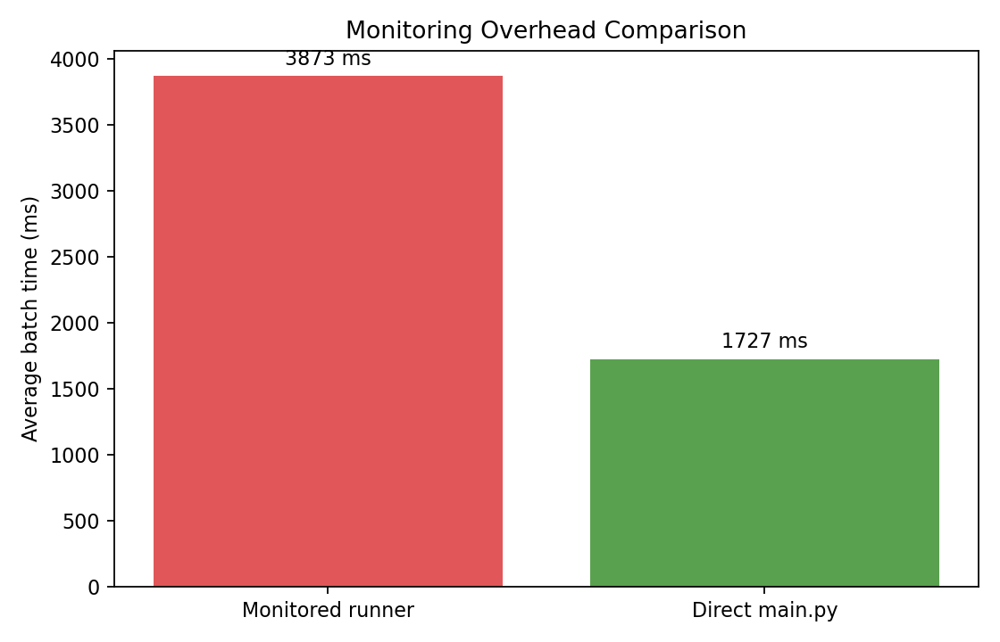
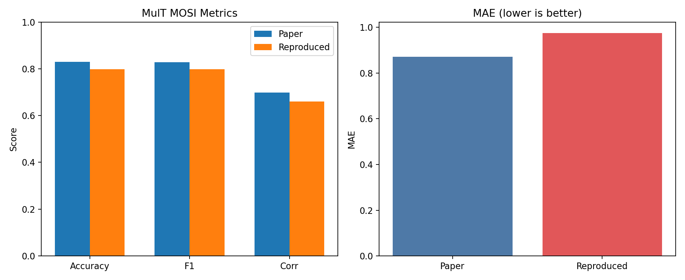

# MulT MOSI 本地低算力复现项目

基于 ACL 2019 论文 [Multimodal Transformer for Unaligned Multimodal Language Sequences](https://aclanthology.org/P19-1656/) 的官方仓库，本项目面向单张 `RTX 4060 8GB` 显卡，对 `CMU-MOSI` 多模态情感分析任务进行了本地复现、误差诊断与最小调参分析。

原始官方实现仓库来自 [yaohungt/Multimodal-Transformer](https://github.com/yaohungt/Multimodal-Transformer)。当前仓库在其基础上完成了新环境兼容、低显存运行、实验记录与结果分析整理。

## 项目任务

本项目的目标不是泛化成完整研究框架，而是围绕一个明确任务展开：

1. 选择Multimodal Transformer for Unaligned Multimodal Language Sequence论文。
2. 在本地 `RTX 4060 8GB` 环境中完成可运行、可复现实验。
3. 对复现结果与论文指标进行对比。
4. 分析误差来源，并继续验证关键因素，例如 `AMP` 和最小调参。

最终选定论文为：

- 论文：`MulT: Multimodal Transformer for Unaligned Multimodal Language Sequences`
- 会议：`ACL 2019`
- 任务：`CMU-MOSI` 多模态情感分析
- 选择原因：模型规模较小、官方代码和处理后特征可获得、适合低算力本地复现

## 操作计划

本项目按以下顺序推进：

1. 检查本地硬件与 Python 环境，确认单卡 4060 可用。
2. 选择论文与复现边界，锁定 `MulT + MOSI + 核心结果复现`。
3. 克隆官方仓库并梳理入口、模型、训练、评估代码。
4. 修复新环境兼容问题：
   - 去掉旧版全局 `cuda tensor` 默认设置
   - 改为显式 `device`
   - 修复 `torch.load` 新版兼容
   - 移除训练结束交互阻塞
   - 参数化 `proj_dim` 和时序卷积核
5. 提供 `--preset mosi_paper`，锁定论文附录中的 MOSI 参数。
6. 在低显存约束下引入 `grad_accum_steps`，保证有效 batch 尽量贴近论文。
7. 先做 smoke test，再做完整 100 epoch 训练。
8. 对比论文指标，定位误差来源。
9. 进一步做 `AMP on/off` 对照和最小调参筛选。

## 环境与硬件

本次实际复现使用环境：

- OS: `Windows 11`
- Python: `3.12.7`
- PyTorch: `2.5.0`
- CUDA runtime: `12.1`
- GPU: `NVIDIA GeForce RTX 4060 8GB`

项目中曾创建隔离环境 `mult-repro`，但最终复现与后续实验实际使用的是本机 `base` 环境，因为其已有可用的 CUDA 版 PyTorch。

## 代码改动概览

为适配本地低算力复现，本项目对官方仓库做了以下关键改动：

- `main.py`
  - 新增 `--preset mosi_paper`
  - 新增 `--grad_accum_steps`
  - 新增 `--no_prompt`
  - 新增 `--no_amp`
  - 显式管理 `device`
- `src/models.py`
  - 将 `proj_dim` 和三路时序卷积核参数化
- `src/train.py`
  - 支持梯度累积
  - 支持可开关 AMP
  - 兼容新版本 PyTorch AMP API
- `src/utils.py`
  - 增加 `torch.load` 兼容封装
  - 保存/加载改为 state dict 形式
- `src/dataset.py`
  - 移除旧版默认 CUDA tensor 行为
- `modules/position_embedding.py`
  - 修复新版 PyTorch 下的 `view/reshape` 与缓存问题
- `scripts/setup_mosi_data.py`
  - 自动提取 `mosi_data_noalign.pkl`
- `reports/`
  - 固化复现结果、图表和 AMP/调参分析

## 运行过程

### 1. 数据准备

本项目使用官方处理后的 MOSI 特征文件：

- `data/mosi_data_noalign.pkl`

数据形状如下：

- `train`: `text=(1284, 50, 300)`, `audio=(1284, 375, 5)`, `vision=(1284, 500, 20)`
- `valid`: `text=(229, 50, 300)`, `audio=(229, 375, 5)`, `vision=(229, 500, 20)`
- `test`: `text=(686, 50, 300)`, `audio=(686, 375, 5)`, `vision=(686, 500, 20)`

### 2. 论文参数设定

`--preset mosi_paper` 对应的核心参数为：

- dataset: `mosi`
- non-aligned setting
- epochs: `100`
- lr: `1e-3`
- layers: `4`
- heads: `10`
- proj dim: `40`
- kernels `(l/a/v)`: `1/3/3`
- dropout 相关参数：按论文附录设定映射

### 3. 低显存运行策略

论文默认 batch 对本地 8GB 显存过大，因此实际完整训练采用：

- `batch_size=32`
- `grad_accum_steps=4`
- effective batch = `128`

最终完整训练命令：

```powershell
python -u main.py --preset mosi_paper --no_prompt --batch_size 32 --grad_accum_steps 4 --name mosi_full_bs32_ga4 --log_interval 1
```

### 4. 训练速度问题与修正

项目中曾尝试加入“实时监控训练进程”的包装器，结果发现：

- 高开销监控版平均 batch 时间约 `3872.62 ms`
- 直接运行 `main.py` 的场景平均 batch 时间约 `1727.32 ms`

原因不是模型计算本身变慢，而是监控包装器把每个 batch 的 stdout 管道化、解析并持续写状态文件，显著增加了 I/O 与进程间通信成本。最终完整复现实验退回到“仅终端输出 batch”的方式。



## 实验结果

### 完整 100 epoch 复现结果

- Runtime: `9298.60 s`，约 `2h 34m 59s`
- Peak CUDA memory: `8956.82 MB`

最终测试指标：

- `Accuracy = 0.7988`
- `F1 = 0.7981`
- `Corr = 0.6593`
- `MAE = 0.9749`

与论文对比如下：

| Metric | Paper | Reproduced | Delta |
| --- | ---: | ---: | ---: |
| Accuracy | 0.8300 | 0.7988 | -0.0312 |
| F1 | 0.8280 | 0.7981 | -0.0299 |
| Corr | 0.6980 | 0.6593 | -0.0387 |
| MAE | 0.8710 | 0.9749 | +0.1039 |



## 结论分析

### 1. 为什么 Corr 达标但 Accuracy、F1、MAE 落后

当前最重要的结论是：

- 模型的排序能力还可以，所以 `Corr` 接近论文并达到本地验收线。
- 但模型输出存在幅度压缩和轻微正偏，导致：
  - `MAE` 更差
  - 在 `0` 附近的符号判定更容易出错
  - 因此 `Accuracy/F1` 落后

也就是说，这次复现更像是“方向大体学对了，但数值校准不够准”。

### 2. AMP 对结果的影响

为了验证 `AMP` 是否是误差源，项目做了受控对照实验：

- 同一数据集
- 同一有效 batch
- 同一训练轮数 `6 epochs`
- 唯一区别：`AMP on/off`

结果：

| Config | Best valid loss (6 ep) | Best test loss (6 ep) | MAE | Corr | F1 | Acc | Time (s) |
| --- | ---: | ---: | ---: | ---: | ---: | ---: | ---: |
| AMP on | 1.2826 | 1.2108 | 1.2200 | 0.4289 | 0.6595 | 0.6616 | 253.27 |
| AMP off | 1.2222 | 1.1453 | 1.1565 | 0.5084 | 0.7323 | 0.7317 | 333.61 |

结论：

- `AMP off` 在受控对照里明显优于 `AMP on`
- 因此 `AMP` 很可能是当前精度损失的主要来源之一
- 代价是时间增加约 `31.7%`

### 3. 最小调参筛选结果

项目还测试了两组最小改动：

- `out_dropout=0.0`
- `dropouts=0.1 + out_dropout=0.0`

它们都没有优于最强的对照配置，因此当前最值得继续完整跑满 100 epoch 的下一组实验不是“改 dropout”，而是：

- `no_amp`
- `batch_size=16`
- `grad_accum_steps=8`
- 其余保持论文 preset 不变

详细对照记录见：

- `reports/mosi_report.md`
- `reports/amp_tuning_summary.md`
- `reports/mosi_comparison.json`

## 如何运行

注意：当前仓库默认不提交原始数据、压缩包和训练 checkpoint，避免 GitHub 仓库体积失控。你需要自行准备 `data/mosi_data_noalign.pkl`，再执行下面的命令。

### 数据提取

```powershell
python .\scripts\setup_mosi_data.py
```

### 完整复现实验

```powershell
python -u main.py --preset mosi_paper --no_prompt --batch_size 32 --grad_accum_steps 4 --name mosi_full_bs32_ga4 --log_interval 1
```

### AMP 对照实验

```powershell
python -u main.py --preset mosi_paper --no_prompt --batch_size 16 --grad_accum_steps 8 --num_epochs 6 --log_interval 10 --name amp_diag_on
python -u main.py --preset mosi_paper --no_prompt --batch_size 16 --grad_accum_steps 8 --num_epochs 6 --log_interval 10 --no_amp --name amp_diag_off
```

### 下一轮推荐实验

```powershell
python -u main.py --preset mosi_paper --no_prompt --batch_size 16 --grad_accum_steps 8 --no_amp --name mosi_full_noamp_bs16_ga8 --log_interval 1
```

## 项目结构

```text
.
├─ main.py
├─ modules/
├─ scripts/
├─ src/
├─ reports/
│  ├─ mosi_report.md
│  ├─ amp_tuning_summary.md
│  ├─ mosi_comparison.json
│  └─ figures/
├─ REPRO.md
└─ run_mosi.ps1
```

## 当前结论

- 已完成 `MulT` 在 `CMU-MOSI` 上的本地可运行复现
- 已完成完整 100 epoch 实验
- 已完成论文指标对比
- 已定位“实时监控导致训练变慢”的原因
- 已通过受控实验确认 `AMP` 很可能是当前结果差距的重要来源之一
- 已给出下一轮最小风险提升方案：`no_amp + bs16 + ga8`

## 致谢

原始论文与实现版权归原作者所有。本仓库是基于官方实现做的本地复现、兼容性修改和实验整理。
